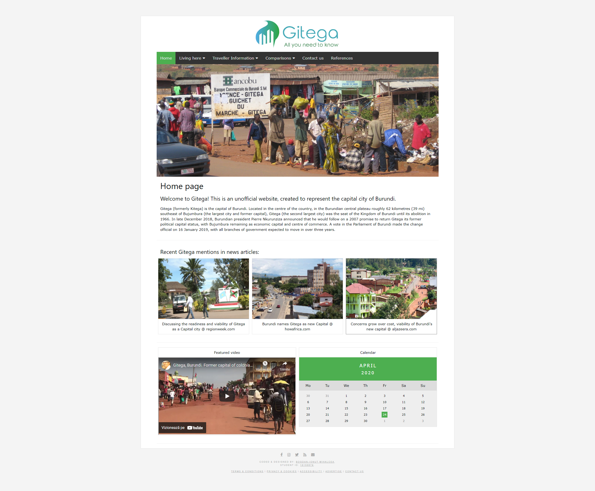

# gitega_website
> Simple website created for an assignemnt during my studies at [_Birmingham City University_](https://bcu.ac.uk). 
> Live demo [_here_](https://bogdanmihalcea.ro/projects/gitega_website).

## Table of Contents
* [General Info](#general-information)
* [Technologies Used](#technologies-used)
* [Screenshots](#screenshots)
* [Project Status](#project-status)
* [Contact](#contact)

## General Information
Simple website I developed for an assignment at university. It does not have any special features, however it is responsive and built from the ground up without using any framework.

## Technologies Used
- HTML5, CSS

## Screenshots

## Project Status
Project is: _complete_ & _no longer being worked on_.

## Contact
Created by [@Bogdan Mihalcea](https://bogdanmihalcea.ro/) - feel free to contact me!